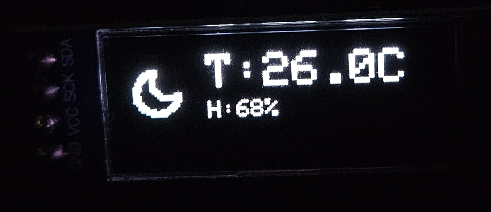
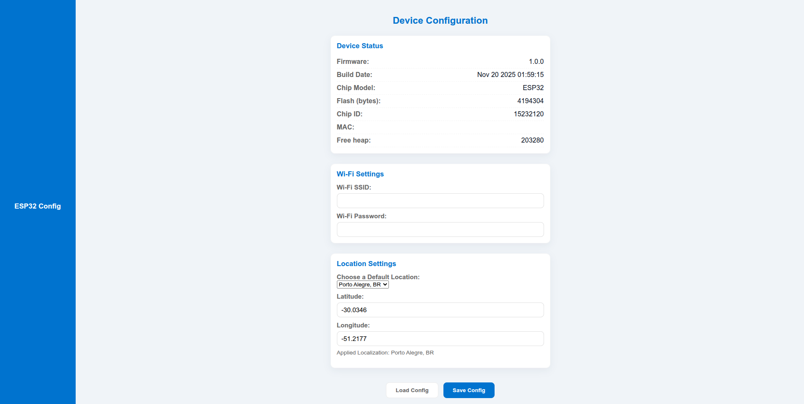

# 🌤️ ESP32 Weather Display — ESP-IDF Version

**A refined and modular IoT weather station using ESP-IDF**  
Displays real-time weather data from **Open-Meteo** on a **0.91" OLED (128×32)**.

<p align="center">
  
  
</p>

---

## 🧭 Overview

This project is a new and improved version of the original Arduino-based Weather Display, now rewritten using **ESP-IDF** for higher reliability and modular architecture.

It features:

✔ Wi-Fi Client + **Config and Status Portal for configuration**  
✔ Real-time weather retrieval from **Open-Meteo API**  
✔ JSON parsing and graphic rendering on SSD1306 OLED  
✔ Persistent storage using **NVS** and **LittleFS**  
✔ Icons showing weather state and day/night 

---

## ⚙️ Hardware

- **Microcontroller:** ESP32 (WROOM-32 or compatible)  
- **Display:** 0.91” OLED, 128x32 pixels (SSD1306)
- **Button** Used to enter AP config mode
- **Power:** USB or Li-Ion battery (optional)  
- **Connections:** I2C for OLED, Wi-Fi for data  

---

## 💻 Software / Firmware

- **ESP32 firmware** written in **C / ESP-IDF**  
- Wi-Fi auto-connect
- AP Mode setup when button pressed
- HTTP Server + embedded web page
- Sends **HTTP GET request** to Open-Meteo API
- Parses JSON response to extract:
  - Temperature
  - Humidity
  - Weather condition
- Updates the **OLED display** in real time
- LittleFS filesystem (Captive portal storage)

The system runs continuously under FreeRTOS.

---

## 📚 Dependencies & Resources

### ESP-IDF External Dependencies
The following ESP-IDF libraries are required to compile and run this project:

- [Joltwallet esp_littlefs](https://github.com/joltwallet/esp_littlefs) – for flash LittleFS   

> ⚠️ Make sure to install the above libraries via ESP-IDF Manager before compiling the code.

### Icons & Conversion Tools
- Weather icons downloaded from [Feather](https://feathericons.com/)  
- SVG to C array conversion done using [DisplayGenerator](https://rickkas7.github.io/DisplayGenerator/index.html)  

---

## 🧱 Partitions Layout – partitions.csv

This project uses a **custom partition table** to support:
- 📁 **LittleFS - storage** for UI assets
- 💾 **NVS - data** for persistent configuration
- 🔧 **factory - app** for large firmware

Example `partitions.csv` content:

```csv
# ESP-IDF Partition Table (simple, no OTA)
# Name,    Type, SubType, Offset,   Size,     Flags
nvs,       data, nvs,     0x9000,   0x10000,
phy_init,  data, phy,     0x19000,  0x1000,
factory,   app,  factory, 0x20000,  0x200000,
storage,   data, littlefs,  0x220000, 0x1E0000,
```
🔍 Notes

- The factory app partition was increased to 2 MB to prevent firmware overflow during linking and flashing.

- The LittleFS storage partition provides memory for the Wi-Fi config portal and web UI files.

⚠️ Important Warning

If you previously flashed the board using a default ESP-IDF partition table,
you must erase the flash before flashing this new layout:

```bash
idf.py erase-flash
idf.py flash monitor
```

Skipping the erase step may lead to:  
✔️ Boot loops  
✔️ Corrupted NVS keys  
✔️ FS mount failure (storage offset mismatch)  

---

## 🌐 Configuration and Status Portal

To ensure a fast and user-friendly configuration process, the ESP32 automatically enters **Access Point (AP) mode** if no valid Wi-Fi credentials are found in NVS or if **press and hold** the button before power-on or reset!

📡 **Automatic Setup**
- The user should connects to the ESP32 Wi-Fi network SSID: ESP_Config
- Visit: http://192.168.4.1/

<p align="center">
  
</p>

📌 The configuration page allows changing:
- Wi-Fi SSID and Password
- Location settings (List of Cities or manualy insert coordinates)

Once the configuration is saved:
- Data is stored in NVS
- The device automatically reboots and connects to Wi-Fi

🎯 This enables a **cable-free**, **plug-and-play**, and **consumer-friendly** setup experience.

---

## 🧩 Notes

This project was intentionally kept **simple and educational**, focusing on core IoT and display concepts rather than full optimization or modularization.  
Some design choices were made for clarity and learning purposes:
  
- The **temperature** and **humidity** are displayed using plain text and icons rather than a graphical UI to keep memory usage low.  
- **No OTA or non-blocking Wi-Fi reconnect** logic is included — this could be added for robustness in real-world deployments.  
- The **Open-Meteo** data update frequency is intentionally limited to avoid exceeding the free API rate limit.  
- The project **does not use an NTP server** for real-time clock synchronization; instead, the **local day/night status** is provided by Open-Meteo — this keeps the code simpler and reduces dependencies.

These decisions aim to make the project easy to read, compile, and modify, while still demonstrating key IoT and embedded development concepts.